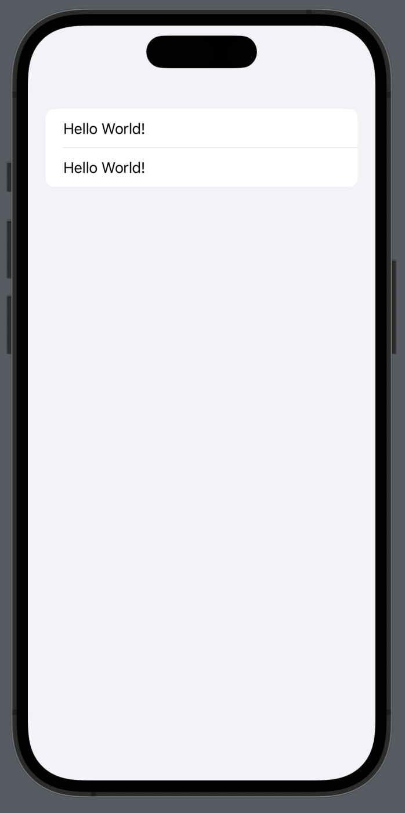
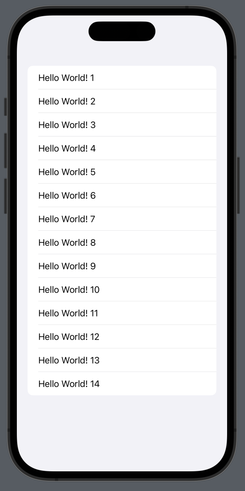
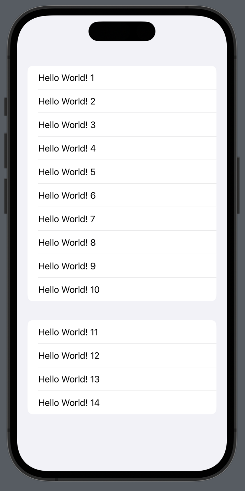
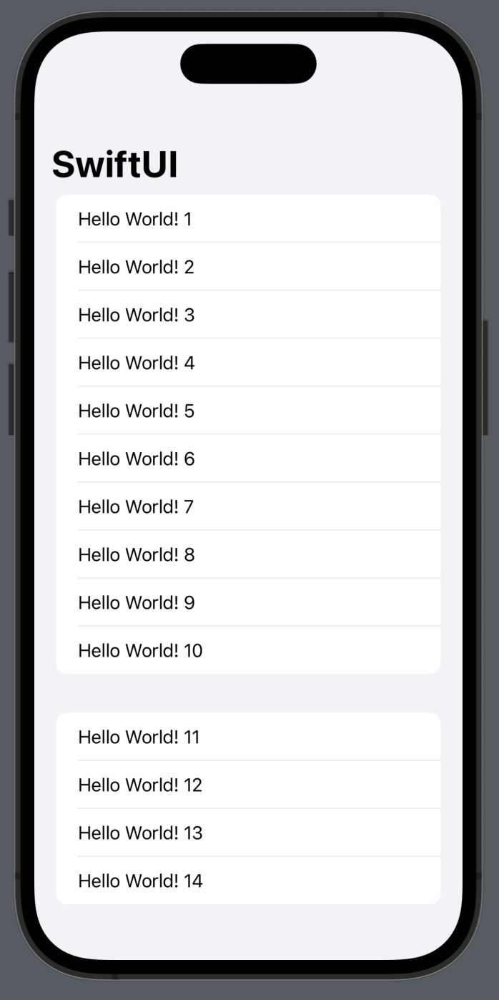
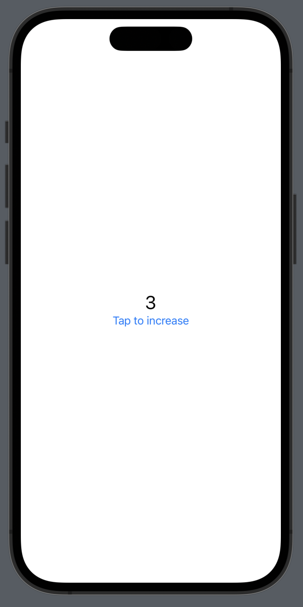
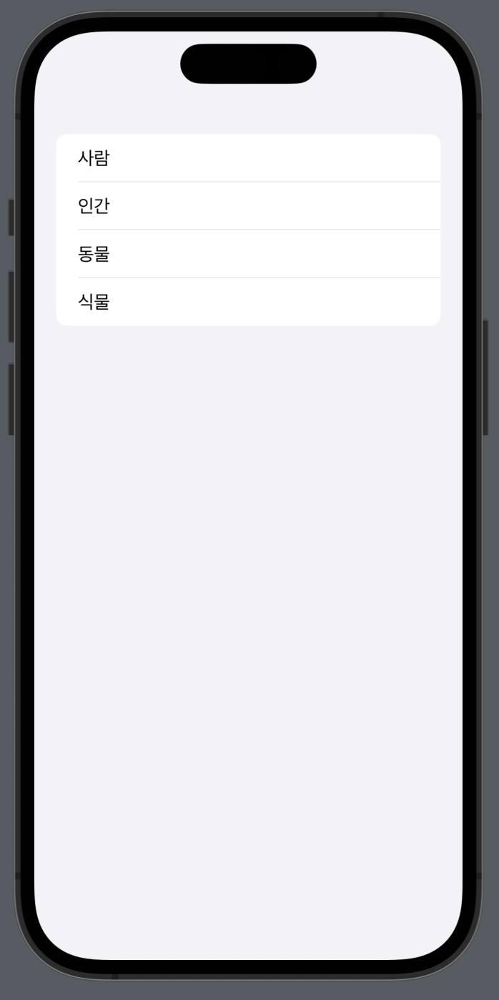

## 2023/04/30

### SwiftUI 학습 키워드
- View
- PreviewProvider
- Text
- Form
- Group
- Section
- NavigationView
- State
- Binding
- TextField
- ForEach

### View
`View`는 SwiftUI의 `Image`, `Text`, `Form` 등 화면에 나타나는 모든 View가 채용한 Protocol이다.

아래 코드에서 ContentView는 `View` 프로토콜을 채용하고 있다. ContentView 구조체를 통해 보여주고자 하는 UI 코드는 연산 프로퍼티인 body의 return 값으로 작성한다.

``` Swift
struct ContentView: View {
    var body: some View {
        Text("Hello, World!")
    }
}
```

### PreviewProvider
SwiftUI로 작성한 UI 미리보기가 XCode의 Canvas를 통해 어떻게 나타날지 코드로 작성할 때 채용하는 Protocol이다. 코드는 아래와 같이 작성한다.

``` swift
struct ContentView_Previews: PreviewProvider {
    static var previews: some View {
        ContentView()
            .previewDevice("iPhone 14 Pro")
    }
}
```

### Text
Text는 문자열을 UI 상에 출력할 때 사용하는 타입이다. 코드로 문자열을 출력할 때 `Text("Hello World")` 와 같은 형태로 작성한다.
``` swift
// 이렇게 작성하면 문자열의 폰트를 수정할 수 있다.
Text("Hello guys!")
	.font(Font.title)
```

Text 타입은 기본적으로 Localization을 지원한다. `Text("pencil")`이라고 코드를 작성하였을 때, Localizable.strings 파일에 "pencil"에 대응하는 한국어 텍스트가 있으면 해당 텍스트를 출력한다. (보통 "연필"로 지정했을 테니, 연필로 출력될 것이다)

### Form
Form은 Static한 List를 생성할 때 사용하는 타입이다. Form을 통해 출력하는 아이템의 갯수가 고정되어 있을 때 사용한다.
``` swift
Form {
	Text("Hello, World!")
	Text("Hello, World!")
}
```



### Group
기본적으로 SwiftUI는 Container View에 자식 View를 총 10개까지 추가할 수 있다. 만약 10개보다 더 많이 추가하고 싶을 경우, Group을 사용하여 아래 코드와 같이 작성한다.

``` swift
Form {
	// Group을 통해 Container View의 자식 View를 2개로 바꾸어주었다.
	Group {
		Text("Hello World! 1")
		Text("Hello World! 2")
		Text("Hello World! 3")
		Text("Hello World! 4")
		Text("Hello World! 5")
		Text("Hello World! 6")
		Text("Hello World! 7")
		Text("Hello World! 8")
		Text("Hello World! 9")
		Text("Hello World! 10")
	}
	Group {
		Text("Hello World! 11")
		Text("Hello World! 12")
		Text("Hello World! 13")
		Text("Hello World! 14")
	}
}
```

### Section
`Section`은 `List`, `Form`, `Picker`에서 section을 나눌 때 사용하는 타입이다. 아래 코드와 같이 작성하여 사용할 수 있다.
``` swift
Form {
	Section {
		Text("Hello World! 1")
		Text("Hello World! 2")
		Text("Hello World! 3")
		Text("Hello World! 4")
		Text("Hello World! 5")
		Text("Hello World! 6")
		Text("Hello World! 7")
		Text("Hello World! 8")
		Text("Hello World! 9")
		Text("Hello World! 10")
	}
	Section {
		Text("Hello World! 11")
		Text("Hello World! 12")
		Text("Hello World! 13")
		Text("Hello World! 14")
	}
	}
```

### NavigationView
`NavigationView`는 화면에 Navigation Bar를 띄우고 싶을 때 사용하는 타입이다. `Navigation View` 타입을 사용한 후, 자식 View에서 `navigationTitle` 메서드를 통해 어떤 문자열을 띄울지 지정해줄 수 있다.
``` swift
 NavigationView {
	Form {
		Section {
			Text("Hello World! 1")
			Text("Hello World! 2")
			Text("Hello World! 3")
			Text("Hello World! 4")
			Text("Hello World! 5")
			Text("Hello World! 6")
			Text("Hello World! 7")
			Text("Hello World! 8")
			Text("Hello World! 9")
			Text("Hello World! 10")
		}
		Section {
			Text("Hello World! 11")
			Text("Hello World! 12")
			Text("Hello World! 13")
			Text("Hello World! 14")
		}
	}
	.navigationTitle("SwiftUI")
}
```

### State
`State`는 SwiftUI에서 화면에 직접 출력되는 값 중 유기적으로 변할 수 있는 값에 사용하는 Property Wrapper이다. `State`는 아래 코드와 같이 작성하여 사용할 수 있다.
``` swift
struct ContentView: View {
    @State private var number: Int = 0
    
    var body: some View {
        VStack {
            Text("\(number)")
                .font(.title)
            Button("Tap to increase") {
                number += 1
            }
        }
    }
}
```

만약 위 코드의 `@State private var number: Int = 0`에서 `@State`를 제외하면 struct 타입은 immutable이므로 `number += 1` 연산을 수행할 수 없게 된다.
### Binding
`Binding`은 `State`를 다른 곳에 전달할 때 사용하는 타입이다. `State` Property Wrapper를 통해 선언된 타입의 값을 `Binding`으로 변환할 때에는 변수 이름 맨 앞에 $를 붙이면 된다.

아래 코드에서는 name의 앞에 $를 붙여 $name이란 변수명으로 `Binding` 변수를 전달하고 있다.
``` swift
struct ContentView: View {
    @State private var name: String = ""
    
    var body: some View {
        Form {
            TextField("Please input your name", text: $name)
            Text("Your name is \(name.isEmpty ? "not inputed" : name)")
        }
    }
}
```
### ForEach
``` swift
struct ContentView: View {
    private var nameList = ["사람", "인간", "동물", "식물"]
    var body: some View {
        Form {
            ForEach(nameList, id: \.self) { name in
                Text(name)
            }
        }
    }
}
```
`ForEach `는 프로그래밍 언어의 for문처럼 여러 데이터를 View로 표현하고 싶을 때 사용한다. 위와 같은 코드를 작성하였을 때, 아래의 이미지의 결과를 얻게 된다.
